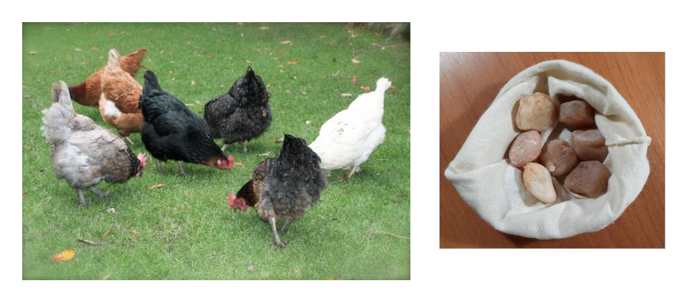

# Aula 1 - Conjuntos Numéricos (revisão)

> Uma revisão dos conjuntos numéricos comumente vistos no ensino médio e uma breve apresentação de conceitos a serem explorados mais à frente

## Naturais ($\mathbb{N}$)

  O Conjunto dos Naturais (representado por $\mathbb{N}$) é composto por números que servem para contagem ou ordenação.
   
   
  Veja o exemplo do número $3$: este símbolo "3" é o símbolo usado no sistema hindu-arábico para representar a <strong>quantidade três</strong>, ou seja, a quantidade de elementos de qualquer conjunto que possa ser colocado em correspondencia de um-para-um com o conjunto $\{x, y, z\}$ ou com o conjunto $\{!, @, \#\}$ (ou qualquer conjunto com esta mesma <strong>quantidade</strong> de elementos).
   
   
  Perceba que o <strong>número</strong> três é o conceito abstrato da quantidade três, enquanto o <strong>algarismo</strong> 3 é apenas um símbolo usado para representar o <strong>numeral</strong> 3, que por sua vez é a representação escrita do número $3$
   
  Ou seja:
   
  <ul>
    <li>
      <strong>Número:</strong> Ideia de quantidade (ex.: o número quarenta e dois)
    </li>
    <li>
      <strong>Algarismo:</strong> Cada símbolo básico usado para construir a escrita do número (ex.: os algarismos $4$ e $2$ ou os algarismos $X$, $L$ e $I$)
    </li>
    <li>
      <strong>Numeral:</strong> A representação escrita do número (ex.: o numeral $42$, ou o numeral $XLII$)
    </li>
  </ul>
   
  É importante mencionar que nem sempre a humanidade dispôs de palavras ou símbolos para representar quantidades. Há relatos de que muito tempo atrás os humanos recorriam a sacos com pedras para representar quantidades. Por exemplo, a quantidade de galinhas na imagem abaixo seria representada pelo saco de pedras ao lado, em que cada pedra correspondia a uma única galinha e cada galinha correspondia a uma única pedra. Daí surge a palavra <strong>Calcular</strong>, que significa "fazer conta com pedras". Assim, pode-se dizer que o uso de sacos com pedras foi o primeiro sistema (rudimentar) de numeração.
   

  

   
  Um grande progresso foi o uso de palavras para representar quantidades e, posteriormente, o advento de símbolos para representá-las. Houveram diversos sistemas de numeração que associavam símbolos a quantidades, sendo o sistema de numeração romano um dos mais conhecidos. Atualmente, porém, o sistema mais amplamente difundido e usado é o sistema hindu-arábico, que possui dez símbolos: 0, 1, 2, 3, 4, 5, 6, 7, 8 e 9. A partir de combinações desses símbolos podemos representar cada número natural.

  <h3 id="Números naturais">
    <strong>DEFINIÇÃO</strong>
  </h3>
  

    O <strong>conjunto dos números naturais</strong> é o conjunto denotado por $\mathbb{N}$ e dado por
     
  

  

    $$\mathbb{N}≔\{0, 1, 2, 3, 4, 5, 6, 7, 8, 9, 10, 11, 12, 13, 14, ... \}$$
     
  

  

    A notação $\mathbb{N}^*$ exclui o $0$, e refere-se aos <strong>naturais não nulos</strong>, ou seja:
  

  

    $$\mathbb{N}^*≔\{1, 2, 3, 4, 5, 6, 7, 8, 9, 10, 11, 12, 13, 14, ... \}$$
     
  

#### **Observação:**
O símbolo " $≔$ " signigica que a igualdade ali representada é uma **definição**, isto é, uma descrição daquilo. É como está definido e, portanto, não necessita de prova.

As quatro operações fundamentais, adição($+$), subtração($-$), multiplicação ($\cdot$) e divisão($\div$), uma vez que são operações abstratas, não dependem do sistema numérico para serem executadas. Mesmo no caso do saco com pedras, ainda é possível realizá-las, dentro do princípio de que somar é juntar, subtrair é retirar, multiplicar é juntar partes iguais e dividir é separar em partes iguais. Vejamos agora, parte destas operações e suas propriedades.

As operações de adição e multiplicação (em $\mathbb{N}$ ) satisfazem as seguintes propriedades:

| Propriedade | O que dizem | Significado |
|-------------|-------------|-------------|
| **Fechamento** | $$a+b, a\cdot b \in \mathbb{N}, \forall a, b \in \mathbb{N}$$ | Os números $a + b$ e $a \cdot b$ pertencem aos naturais, quaisquer que sejam $a$ e $b$ naturais |
| **Associatividade** | $$(a+b)+c = a+(b+c)$$ e $$(a\cdot b)\cdot c = a\cdot (b\cdot c), \forall a, b, c \in \mathbb{N}$$ | $$(a+b)+c = a+(b+c)$$ e $$(a\cdot b)\cdot c = a\cdot (b\cdot c)$$, quaisquer que sejam $a$, $b$ e $c$ naturais |
| **Comutatividade** | $$a + b = b + a$$ e $$a\cdot b = b\cdot a, \forall a, b \in \mathbb{N}$$ | $$a + b = b + a$$ e $$a\cdot b = b\cdot a$$, quaisquer que sejam $a$ e $b$ naturais |
| Existência do **elemento neutro** | $$a+0 = a$$ e $$a\cdot 1 = a, \forall a \in \mathbb{N}$$ | $$a+0 = a$$ e $$a\cdot 1 = a$$, para todo $a$ natural |
> Nota: para rever os significados dos sinais acima, e outros, [clique aqui](../arquivos_uteis_s1/simbolos_matematicos_e_logicos.md)
